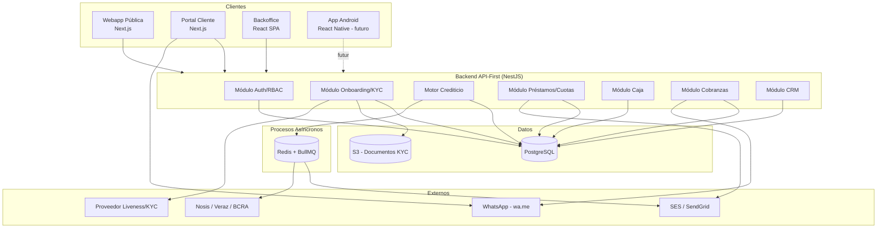

# Presto Cuotas — Arquitectura Técnica

## 1. Principios de diseño

- **API-First**: un único backend expone una API REST versionada (`/api/v1`) documentada con OpenAPI/Swagger. Webapp pública, portal de cliente, backoffice y la futura app Android consumen la misma API — cero lógica de negocio duplicada en clientes.
- **Desacoplamiento fuerte**: backend, frontend público, backoffice y storage de documentos son deployables independientes.
- **Auditable por diseño**: toda acción sensible (aprobar/rechazar solicitud, registrar cobro, cambiar tasa) queda en `auditoria`.
- **Cumplimiento normativo (Argentina)**: Ley 25.326 de Protección de Datos Personales, comunicaciones BCRA sobre otorgamiento de crédito y KYC. Esto condiciona cifrado, retención y trazabilidad de documentación (DNI, selfie).

## 2. Stack recomendado

| Capa | Tecnología | Justificación |
|---|---|---|
| Backend | **Node.js + NestJS (TypeScript)** | Arquitectura modular por dominio (Clientes, Solicitudes, Préstamos, Caja...), Guards/Decorators nativos para RBAC, generación automática de OpenAPI (clave para contrato compartido con la app Android), integración directa con BullMQ para colas. |
| Backend (alternativa) | Python + FastAPI | Válida si el equipo prioriza Python (p. ej. para el motor de scoring a futuro con ML). Se pierde algo de cohesión de tipos si el frontend es TS. Se recomienda NestJS como opción principal. |
| Base de datos | **PostgreSQL 15+** | Transaccional, soporta `pgcrypto` para cifrado de campos PII, `JSONB` para respuestas crudas de burós, buen soporte de constraints/checks para reglas de negocio (montos, estados). |
| Cache / Colas | Redis + BullMQ | Colas para: consulta a buró (Nosis/Veraz), envío de emails, generación de PDF de comprobantes, procesamiento de documentos KYC. |
| Storage de documentos | S3 (o compatible: Backblaze B2 / MinIO on-prem) | DNI frente/dorso y selfie **nunca** se guardan como BLOB en la DB. Se guardan en bucket privado, acceso vía URLs firmadas de corta duración, cifrado server-side (SSE). |
| Frontend público + simulador | **Next.js (React)** | SSR/SSG necesario para SEO de la landing comercial y el simulador de préstamos. |
| Portal de cliente | Next.js (rutas protegidas de la misma app pública) | Reduce superficie de mantenimiento; solo requiere auth de cliente. |
| Backoffice (Caja, Riesgo, Cobranzas, Admin) | React + Vite SPA, Tailwind + shadcn/ui | No requiere SEO; SPA da mejor UX para operación intensiva (cajero, analista). |
| App móvil (futuro) | React Native | Reutiliza tipados y cliente API generado desde el spec OpenAPI (`openapi-typescript` / `orval`). Kotlin nativo queda como alternativa si se prioriza performance de cámara para KYC (liveness). |
| Autenticación | JWT (access 15 min + refresh 7 días), Argon2 para hashing de contraseñas | Estándar, stateless, escala bien entre web/app móvil. |
| RBAC | Tablas `roles` + `permisos` + Guards de NestJS | Roles: Administrador General, Analista de Crédito, Cajero/Operador. |
| Integración Buró | Adapter/Strategy pattern (`BuroProviderInterface`) con implementaciones `NosisProvider`, `VerazProvider`, `BcraProvider` | Permite agregar/cambiar proveedor sin tocar el motor de reglas. |
| Verificación de identidad (liveness) | Proveedor especializado (p. ej. Truora, Incode, o Mati) vía SDK embebido en el wizard KYC | Liveness detection real (anti-spoofing) no se implementa in-house; es responsabilidad de riesgo/cumplimiento delegarlo a un proveedor certificado. |
| Notificación WhatsApp | Enlaces `wa.me` generados por el backend (ver `04-WHATSAPP-INTEGRATION.md`) | No requiere WhatsApp Business API en la v1 (evita costos/homologación); es "click-to-chat", el mensaje lo envía el usuario/operador manualmente. |
| Email | Amazon SES / SendGrid | Envío de estado de cuenta y notificaciones transaccionales. |
| Hosting | Contenedores Docker → AWS ECS Fargate (o Cloud Run) + RDS Postgres administrado + Cloudflare como CDN/WAF delante del frontend | Balance costo/operación para un equipo chico; managed DB reduce riesgo operativo sobre datos sensibles. |
| CI/CD | GitHub Actions → build, test, migraciones (`Prisma`/`TypeORM` migrations), deploy | Gate de tests antes de cualquier deploy a producción. |
| Observabilidad | Logs estructurados (Pino) + Sentry (errores) + métricas básicas (CloudWatch/Grafana) | Prioridad: trazar fallos en consultas a buró y en registro de pagos (dinero real). |

## 3. Diagrama de componentes

## 4. Flujo de la solicitud (alto nivel)

1. Cliente completa simulador (público, sin auth) → `GET /public/simulador`.
2. Cliente inicia onboarding → crea registro en `clientes`, sube DNI frente/dorso/selfie (`documentos_kyc`) → proveedor de liveness valida prueba de vida.
3. Cliente firma digitalmente T&C → se crea `solicitudes` (estado `pendiente`).
4. Backend encola consulta a buró (`logs_buro`) de forma asíncrona.
5. Motor de reglas evalúa: score + límites configurados en `configuracion_tasas` → resultado `pre_aprobada`, `rechazada` automática, o `en_revision`.
6. Si `en_revision`, un Analista de Crédito revisa en Backoffice (informe de buró + documentos KYC) → decide `aprobada`/`rechazada_manual`.
7. Al aprobar, se genera `prestamos` + tabla `cuotas` (plan de pagos).
8. Cliente retira el préstamo en sucursal → Cajero registra entrega.
9. Cliente paga cuotas en efectivo en sucursal → Cajero registra `pagos`, se emite comprobante.
10. Cliente o Cobranzas generan enlaces `wa.me` para estado de cuenta / recordatorios de vencimiento.

## 5. Seguridad y cumplimiento

- PII sensible (DNI, CUIL, imágenes) cifrada en tránsito (TLS) y en reposo (SSE en S3, `pgcrypto` para campos críticos en Postgres si se requiere).
- Acceso a documentos KYC solo vía URLs firmadas de corta expiración, nunca URLs públicas permanentes.
- RBAC estricto: un Cajero no puede ver informes de buró; un Analista no puede registrar cobros.
- Tabla `auditoria` inmutable (solo insert) para toda acción sobre `solicitudes`, `prestamos`, `pagos`, `usuarios`.
- Rate limiting sobre endpoints públicos de onboarding para mitigar solicitudes fraudulentas masivas.
- Retención de datos y derecho de baja conforme Ley 25.326.
